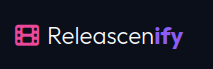

# Releascenify

<p align="center">
  
</p>

<p align="center">
  <a href="https://pypi.org/project/releascenify/"></a>
  <a href="tests/"></a>
</p>

Parse Scene and P2P release names into structured metadata and compare release quality automatically. Built with a rule/regex engine.

**Live Demo:** [https://dmachard.github.io/releascenify/docs/](https://dmachard.github.io/releascenify/docs/)

## Why?
Release names follow a strict grammar inherited from the Scene and P2P groups. Once decoded, you can predict the quality, source, language, and release group just from the filename. This library is an alternative to PTN (Parse Torrent Name).

## Installation

```bash
pip install releascenify
```

## Usage

```python
from releascenify import parse_filename
from releascenify.comparator import get_quality_score, is_better_release

filename = "Gladiator.II.2024.MULTi.2160p.WEB-DL.DV.HDR.H265-GROUP"
parsed = parse_filename(filename)

print(parsed)
# {
#   "title": "Gladiator II",
#   "year": 2024,
#   "resolution": "2160P",
#   "quality": "WEB-DL",
#   "v_quality": "HDR DV",
#   "codec": "H265",
#   "languages": ["MULTI"]
#   ...
# }

# Calculate quality score
score = get_quality_score(parsed)
print(f"Quality Score: {score}")

# Compare two releases
rel_a = parse_filename("Gladiator.II.2024.1080p.BluRay.x264-GROUP")
rel_b = parse_filename("Gladiator.II.2024.2160p.WEB-DL.x265-GROUP")

if is_better_release(rel_b, rel_a):
    print("Release B is better than Release A")
```

## Quality Scoring

For details on how files are rated, scoring weights, and priority factors, see [SCORING.md](SCORING.md).

## Expected Tags & Normalization

Here are the metadata fields extracted by `releascenify` and how their values are normalized:

### Video Codecs (`codec`)
To make release metadata processing and quality comparison consistent, the parser normalizes various representations of codecs:
- **`H265`**: Normalized from inputs containing `H265`, `x265`, `HEVC` (including variants with dots or hyphens like `H.265` or `H-265`).
- **`H264`**: Normalized from inputs containing `H264`, `x264`, `AVC` (including variants with dots or hyphens like `H.264` or `H-264`).
- **`VC-1`**: Normalized from inputs containing `VC1` or `VC-1`.

### Resolutions (`resolution`)
To keep resolution metadata consistent, they are normalized to standard keys:
- **`2160P`**: Normalized from inputs containing `2160p`, `2160P`, `4K`, or `UHD`.
- **`1080P`**: Normalized from inputs containing `1080p` or `1080P`.
- **`720P`**: Normalized from inputs containing `720p` or `720P`.
- **`4KLIGHT`**: Extracted from inputs containing `4KLIGHT`.

### Source Quality (`quality`)
The source tags are normalized to standard quality keys:
- **`WEB-DL`**: Normalized from inputs containing `WEB-DL`, `WEBDL`, or `WEB`.
- **`WEBRIP`**: Extracted from inputs containing `WEBRip` or `WEBRIP`.
- **`BLURAY`**: Extracted from `BLURAY`, `BDRIP`, or `BRRIP`.
- **`REMUX`** / **`DVDRIP`** / **`HDTV`** / **`WEBLIGHT`**

### Audio Codecs (`audio`)
To keep audio metadata consistent, standard audio codecs are normalized as follows:
- **`EAC3`**: Normalized from inputs containing `EAC3`, `E-AC3`, `DDP`, `DDP2.0`, `DDP5.1`, `DDP7.1`, etc. (Dolby Digital Plus).
- **`DTS-HD`**: Normalized from inputs containing `DTS-HD`, `DTS-HDMA`, or `DTS-HD MA`.
- Other standard codecs extracted: **`TRUEHD`** / **`DTS`** / **`AC3`** / **`AAC`** / **`FLAC`** / **`MP3`**.
- Note: If `ATMOS` is present, it is appended to the base codec (e.g., `EAC3 ATMOS`, `TRUEHD ATMOS`). If only Atmos is present, it will be `ATMOS`.

### Audio Channels (`channels`)
- Standard channel counts: **`7.1`** / **`5.1`** / **`2.1`** / **`2.0`** / **`1.0`** (mono).

### Video Enhancements (`v_quality`)
- **`HDR`** / **`HDR10`** / **`HDR10+`** / **`DV`** (Dolby Vision) / **`HLG`** / **`SDR`** / **`10BIT`** / **`12BIT`**

### Languages (`languages`)
- Lists of extracted language tags: **`VFF`** (TrueFrench) / **`FRENCH`** / **`VF`** / **`VF2`** / **`VFI`** / **`VFQ`** / **`VOSTFR`** / **`FASTSUB`** / **`EN`** / **`VO`** / **`MULTI`**

### Network/Platform (`network`)
- Stream/broadcast platform names normalized:
  - `Netflix` (from `NF`)
  - `Amazon Prime` (from `AMZN`, `AMAZON STUDIOS`, `AMAZON PRIME`)
  - `Disney+` (from `DSNP`, `DSNY`, `DISNEY PLUS`)
  - `Apple TV+` (from `ATV`, `APPLE TV PLUS`)
  - `HBO Max` / `HBO` (from `HMAX`, `HBO MAX`, `HBO`)
  - `Hulu` (from `HULU`)
  - `Paramount+` (from `PARAMOUNT PLUS`)

### Special Tags (`extra`)
- Extracted modifiers: **`REPACK`** / **`PROPER`** / **`FINAL`** / **`INTERNAL`** / **`CUSTOM`**.

## Development & Tests

### Setup Local Virtual Environment

To set up the development environment, create a virtual environment and install the package in editable mode with development dependencies:

```bash
virtualenv .venv
source .venv/bin/activate
```

### Run Tests

Run the test suite using `pytest`:

```bash
pytest tests/ -v
```

### Run Website Locally

You need to run a local web server from the repository root:

```bash
# Start a local HTTP server
python3 -m http.server 8000
```

Then navigate to: [http://localhost:8000/](http://localhost:8000/) (which redirects to `/docs/`) or directly to [http://localhost:8000/docs/](http://localhost:8000/docs/).